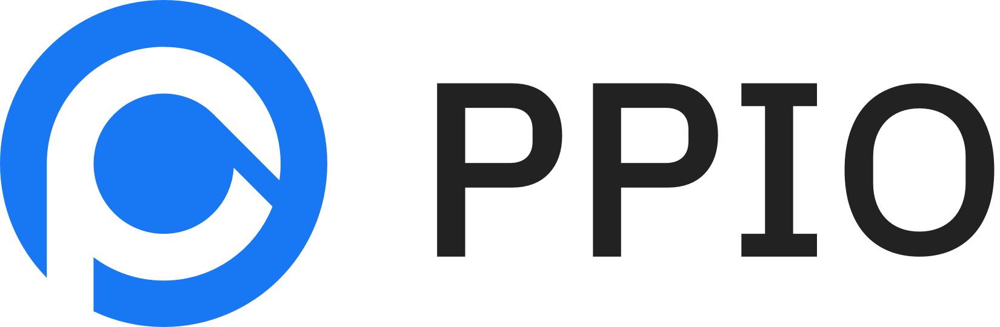

<div align="center">

# CC Switch (Fork)

### Claude Code、Claude Desktop、Codex、Gemini CLI、Grok Build、OpenCode、OpenClaw 和 Hermes Agent 的全方位管理工具

[](https://github.com/qwqwd65-ui/cc-switch/releases)
[](https://github.com/kongkongyo/cc-switch/releases)
[](https://tauri.app/)
[](https://github.com/kongkongyo/cc-switch/releases/latest)

<a href="https://trendshift.io/repositories/15372" target="_blank"></a>
<a href="https://www.star-history.com/#farion1231/cc-switch&Date"><picture><source media="(prefers-color-scheme: dark)" srcset="https://api.star-history.com/badge?repo=farion1231/cc-switch&theme=dark" /></picture></a>

### 🌐 唯一官方网站：**[ccswitch.io](https://ccswitch.io)**

[中文首页](README.md) | [English](README_EN.md) | [日本語](README_JA.md) | [Deutsch](README_DE.md) | 中文 | [更新日志](CHANGELOG.md)

</div>

基于 [farion1231/cc-switch](https://github.com/farion1231/cc-switch) `v3.19.2`（含未发版 main 的模型挡位修复），并保留本 Fork 的自用改动。

**个人自用修改版，主打能用就行。** 新增或修改的功能未经充分测试，**可能存在 bug 或与上游不兼容**，介意请使用[官方版](https://github.com/farion1231/cc-switch)。

## 与上游的区别

| 使用场景 | 官方版 | 本 Fork |
|----------|--------|---------|
| 看当前配置 | 供应商卡片主要显示名称 | 供应商名称旁直接显示当前模型名，Claude 多角色模型会尽量收成短标签 |
| 选择模型 | 长模型列表主要靠滚动查找 | 获取模型后可搜索、按供应商分组，并高亮当前选中的模型 |
| Codex 普通模型 | 非本地路由配置里模型入口较弱 | 非本地路由时可直接填写或获取模型名，并写入 Codex 配置 |
| 供应商专属上游代理 | 只有全局上游代理，按原逻辑统一生效 | 可给指定供应商/渠道单独配置上游代理；启用后只影响该供应商，访问上游都走它，并优先于全局上游代理 |
| 新增供应商 | 新配置默认排到列表最后 | 有已有配置时，新配置默认插到第二位，方便马上启用或调整 |
| 调整供应商顺序 | 主要靠拖拽 | 保留拖拽，并增加右键“一键置顶 / 一键置底” |
| 托盘操作 | 左键更偏向打开托盘菜单 | 左键托盘图标直接显示 / 隐藏主窗口 |
| 连通检测 | 仅检查供应商地址是否可达 | 跟随上游轻量连通检测，不发送真实模型请求，减少误报和额外消耗 |
| 更新方式 | 使用上游自动更新链路 | 检查本 Fork Releases，有新版本时打开发布页，由用户手动下载 |
| 发布来源 | 官方仓库发布 | 本 Fork 独立发布，安装包以本仓库 Releases 为准 |

> 说明：供应商专属上游代理只在请求先进入 CC Switch 本地代理转发时生效；如果专属代理配置错误或不可用，请求会失败，不会悄悄回退到全局上游代理。


## ❤️赞助商

> [想出现在这里？](mailto:farion1231@gmail.com)

<details open>
<summary>点击折叠</summary>

[](https://platform.kimi.com?aff=cc-switch)

Kimi K2.7 Code 是 Moonshot AI 开发的编程专用开源智能体模型。它在编程与智能体执行能力上全面增强，在真实长程编程任务中实现显著提升，带来复杂软件工程工作流中更高的端到端任务成功率。同时，K2.7 Code 优化了推理效率，相较 K2.6 平均减少约 30% 的推理 token 消耗。**[点击此处开启 Kimi 使用体验](https://platform.kimi.com?aff=cc-switch)**

主要做编程工作？可以试试 **[Kimi For Coding 编程套餐](https://www.kimi.com/code/?aff=cc-switch)**，专为编程打造的订阅服务！

---

<table>
<tr>
<td width="180"><a href="https://www.packyapi.com/register?aff=cc-switch"></a></td>
<td>感谢 PackyCode 赞助了本项目！PackyCode 是一家稳定、高效的API中转服务商，提供 Claude Code、Codex、Gemini 等多种中转服务。PackyCode 为本软件的用户提供了特别优惠，使用<a href="https://www.packyapi.com/register?aff=cc-switch">此链接</a>注册并在充值时填写"cc-switch"优惠码，首次充值可以享受9折优惠！</td>
</tr>

<tr>
<td width="180"><a href="https://aigocode.com/invite/CC-SWITCH"></a></td>
<td>感谢 AIGoCode 赞助了本项目！AIGoCode 是一个集成了 Claude Code、Codex 以及 Gemini 最新模型的一站式平台，为你提供稳定、高效且高性价比的AI编程服务。本站提供灵活的订阅计划，零封号风险，国内直连，无需魔法，极速响应。AIGoCode 为 CC Switch 的用户提供了特别福利，通过<a href="https://aigocode.com/invite/CC-SWITCH">此链接</a>注册的用户首次充值可以获得额外10%奖励额度！</td>
</tr>

<tr>
<td width="180"><a href="https://apinebula.ai/VjM74M"></a></td>
<td>Thanks to APINEBULA for sponsoring this project! APINEBULA, an enterprise-grade AI aggregation platform under Galaxy Video Bureau, leverages extensive platform resources to provide developers, teams, and enterprises with stable, cost-effective access to large language model APIs. The platform integrates leading, full-powered models like Claude, GPT, and Gemini, allowing you to connect to the world's top AI models through a single API, with prices starting as low as 10% of the original cost. Designed for AI programming, Agent development, and business system integration, APINEBULA supports enterprise-grade high concurrency, formal contracts, corporate bank transfers, and invoicing services. APINEBULA provides special discounts for our software users: register using <a href="https://apinebula.ai/VjM74M">this link</a> and enter the <strong>"ccswitch"</strong> promo code during your first recharge to get <strong>10% off</strong>.</td>
</tr>

<tr>
<td width="180"><a href="https://www.aicodemirror.ai/register?invitecode=9915W3"></a></td>
<td>Thanks to AICodeMirror for sponsoring this project! AICodeMirror provides official high-stability relay services for Claude Code / Codex / Gemini CLI, with enterprise-grade concurrency, fast invoicing, and 24/7 dedicated technical support.
Claude Code / Codex / Gemini official channels at 38% / 2% / 9% of original price, with extra discounts on top-ups! AICodeMirror offers special benefits for CC Switch users: register via <a href="https://www.aicodemirror.ai/register?invitecode=9915W3">this link</a> to enjoy 20% off your first top-up, and enterprise customers can get up to 25% off!</td>
</tr>

<tr>
<td width="180"><a href="https://pateway.ai/?ch=etzpm8&aff=WB6M6F67#/"></a></td>
<td>Thanks to PatewayAI for sponsoring this project! PatewayAI is an API relay service provider built for heavy AI developers, focused on directly relaying official high-quality model APIs. It offers the full Claude lineup and the Codex series, 100% sourced from official channels — no dilution, no fakes, verification welcome. Billing is transparent and every token-level invoice can be audited line by line.
It also supports enterprise-grade concurrency and provides a dedicated management platform for enterprise customers — formal contracts and invoicing are available; visit the official website for contact details.
Register now via <a href="https://pateway.ai/?ch=etzpm8&aff=WB6M6F67#/">this link</a> to receive $3 in trial credit. Top-ups go as low as 60% of the original price, with a two-way referral bonus of up to $150!</td>
</tr>

<tr>
<td width="180"><a href="https://api.fenno.ai/register?redirect=/purchase?tab=subscription%26group=16&aff=P9MR3D3PLCNL"></a></td>
<td>Thanks to Fenno.ai for sponsoring this project! Fenno.ai is a stable and efficient API relay service provider, currently focused on Codex relay. It is compatible with the OpenAI and Anthropic protocols and can be flexibly used from Codex, Claude Code, OpenCode, and other mainstream coding tools. It reliably supports enterprise-grade workloads of hundreds of billions of tokens per day, with corporate (B2B) settlement and invoicing for both domestic and overseas entities. Fenno.ai offers an exclusive benefit for CC Switch users: subscribe via <a href="https://api.fenno.ai/register?redirect=/purchase?tab=subscription%26group=16&aff=P9MR3D3PLCNL">this link</a> to the $1.99 Trial Plan worth $50 in credits (valid for 7 days), and earn up to 20% in referral rewards — invite more, earn more!</td>
</tr>

<tr>
<td width="180"><a href="https://runapi.host/register?aff=iOKB"></a></td>
<td>Thanks to RunAPI for sponsoring this project! RunAPI is a high-performance and reliable AI model API gateway — one API key gives you access to 150+ mainstream models including OpenAI, Claude, Gemini, DeepSeek, and Grok, with prices as low as 10% of the official rate and excellent stability. It works seamlessly with Claude Code, OpenClaw, and other tools. Exclusive benefit for CC Switch users: register via <a href="https://runapi.host/register?aff=iOKB">this link</a> and enjoy a 10% discount on your first top-up!</td>
</tr>

<tr>
<td width="180"><a href="https://www.shengsuanyun.com/?from=CH_4HHXMRYF"></a></td>
<td>感谢胜算云赞助了本项目！胜算云是专为AI Native Teams服务的超级工厂，工业级AI任务并行执行平台，模型商城集采直供聚合接入了Claude、Chatgpt、Gemini等海内外LLM及图片视频多媒体模型算力，绝无逆向掺水、全站模型SLA可用性高达99.7%、<a href="https://watch.shengsuanyun.com/status/shengsuanyun">监测接口</a>日常全绿。更有企业级专属定制网关，实现团队精细化成本与权限管控，智能路由+安全防护+BYOK企业自带密钥托管。平台按量及tokens plan（即将上线）计费，可开票，使用<a href="https://www.shengsuanyun.com/?from=CH_4HHXMRYF">此链接</a>注册新用户可获10元模力及首充10%赠送。</td>
</tr>

<tr>
<td width="180"><a href="https://pateway.ai/?ch=etzpm8&aff=WB6M6F67#/"></a></td>
<td>感谢 PatewayAI 赞助了本项目！PatewayAI 是一家面向重度 AI 开发者、专注官方直连高品质模型 API 中转服务商。提供 Claude 全系列与 Codex 系列模型，100% 官方源直供，不掺假不注水，欢迎检验。计费透明，Token 级账单可逐笔核验。
同时支持企业级高并发，并为企业客户提供了专业的管理平台，企业客户可签订正式合同并开具发票，更多详情进入官网获取联系方式。
现在通过<a href="https://pateway.ai/?ch=etzpm8&aff=WB6M6F67#/">此链接</a>注册即送 $3 试用额度，用户充值低至 6 折，邀请好友双向赠送，邀请奖励可达 $150！</td>
</tr>

<tr>
<td width="180"><a href="https://teamorouter.com/zh?utm_source=cc_switch&utm_medium=referral&utm_campaign=ai_directory"></a></td>
<td>感谢 TeamoRouter 赞助本项目！TeamoRouter 是一款面向开发者、AI 团队和企业的企业级 Agentic LLM 网关。无需任何订阅，你就可以通过一个统一 API 访问 Claude Code、Codex、Gemini CLI、OpenAI Codex 以及其他热门 AI Agent，同时享受最高可达 90% 折扣的 API 价格。
不同于常见的 API 中转服务，TeamoRouter 聚合了数百家官方模型提供商和可信基础设施合作伙伴，包括 OpenAI、Anthropic、Vertex、Azure 和 AWS Bedrock。每个提供商都经过验证，确保 100% 兼容 Agent 协议，并具备可靠的缓存性能和请求可追踪性，从而提供稳定质量，而不是反向工程或缩水后的接口。平台提供接近官方水平的 TTFT、99.6% SLA、最高 5,000 QPM 的企业级吞吐量，以及行业领先的缓存命中率，可大幅降低长时间运行的 Agent 工作流中的 token 成本。
TeamoRouter 还提供企业级功能，包括集中账单、团队管理、BYOK、智能路由、用量分析、动态提供商优化和专属支持。为了获得更简单的使用体验，Teamo Desktop 支持你一键使用 Claude Code、Codex、Gemini CLI 和其他热门 AI Agent，无需管理 API Key，也无需手动配置网关。新用户通过<a href="https://teamorouter.com/zh?utm_source=cc_switch&utm_medium=referral&utm_campaign=ai_directory">此链接</a>注册，首次充值可享受 10% 折扣。</td>
</tr>

<tr>
<td width="180"><a href="https://zetaapi.ai/go/ccs"></a></td>
<td>感谢 ZetaAPI 赞助本项目！ZetaAPI 主打模型不掺水、保真不降智、价格低至官方价 35 折，平台不混量、不暗中替换低质量模型、不做虚假路由，支持 Claude Code、Codex、Gemini、ChatGPT 等主流模型接入，帮助用户在保证模型质量的同时大幅降低 API 使用成本。同时，ZetaAPI 提供企业级 SLA 稳定性保障、标准接口兼容、一个 Key 接入多模型、快速集成、按量计费等能力，适用于 AI 产品、代码生成、企业内部工具、客服系统、内容生产和自动化流程等场景。若经验证发现模型质量与标称不符，ZetaAPI 承诺假一赔十，让用户用得更稳定、更透明、更放心。通过<a href="https://zetaapi.ai/go/ccs">此链接</a>注册，并在首次充值时使用优惠码 CC-SWITCH，即可享受 CC Switch 用户专属的首次充值九折优惠！</td>
</tr>

<tr>
<td width="180"><a href="https://www.volcengine.com/activity/ai618?utm_campaign=hw&utm_content=hw&utm_medium=devrel_tool_web&utm_source=OWO&utm_term=ccswitch"></a></td>
<td>感谢火山方舟 Agent Plan 模型赞助了本项目！方舟 Agent Plan 模型订阅套餐集成了包含 Doubao-Seed、Doubao-Seedance、Doubao-Seedream 等在内的字节跳动自研 SOTA 级模型，覆盖文本、代码、图像、视频等多模态任务。最新支持 MiniMax-M3、DeepSeek-V4 系列、GLM-5.1、Doubao-Seed-2.0 系列、Kimi-K2.6 等模型，工具不限。超全模态模型与 Harness 升级一步到位，深度支持 Agent 框架与 AI 编程工具。一次订阅，可以为不同任务切换合适的 AI 引擎。方舟 Coding Plan 为 CC Switch 的用户提供了专属福利：通过<a href="https://www.volcengine.com/activity/ai618?utm_campaign=hw&utm_content=hw&utm_medium=devrel_tool_web&utm_source=OWO&utm_term=ccswitch">此链接</a>订阅方舟 Coding Plan，新客户首两个月享 2.5 折优惠，再用专属邀请码 6J6FV5N2 领取奖励叠加 9.5 折，低至 9.4 元/月！<a href="https://www.byteplus.com/en/product/modelark?utm_campaign=hw&utm_content=ccswitch&utm_medium=devrel_tool_web&utm_source=OWO&utm_term=ccswitch">>>For developers outside Mainland China, please click here</a></td>
</tr>

<tr>
<td width="180"><a href="https://cloud.siliconflow.cn/i/YflgU2Ve"></a></td>
<td>感谢硅基流动赞助了本项目！硅基流动是一个高性能 AI 基础设施与模型 API 平台，一站式提供语言、语音、图像、视频等多模态模型的快速、可靠访问。平台支持按量计费、丰富的多模态模型选择、高速推理和企业级稳定性，帮助开发者和团队更高效地构建和扩展 AI 应用。通过<a href="https://cloud.siliconflow.cn/i/YflgU2Ve">此链接</a>注册并完成实名认证，即可获得 ¥16 奖励金，可在平台内跨模型使用。硅基流动现已兼容 OpenClaw，用户可接入硅基流动 API Key 免费调用主流 AI 模型。</td>
</tr>

<tr>
<td width="180"><a href="https://console.apito.ai/agent/register/pQBql2buaqiX3dDS"></a></td>
<td>This project is sponsored by <a href="https://console.apito.ai/agent/register/pQBql2buaqiX3dDS">Claude API</a>. Direct Claude API access — connect Claude Code and Agent apps in 3 minutes. New users can claim a free trial credit.Powered by official Anthropic API keys + AWS Bedrock official channels. No reverse engineering, no model degradation. Full support for Opus / Sonnet / Haiku model lineup, with official capabilities preserved including Tool Use, 1M context window, and more. Built for Claude Code power users, Agent engineers, and enterprise engineering teams. Invoicing and dedicated team support available. Click <a href="https://console.apito.ai/agent/register/pQBql2buaqiX3dDS">here</a> to register!</td>
</tr>

<tr>
<td width="180"><a href="https://code0.ai/agent/register/B2XHxGjGmRvqgznY"></a></td>
<td>Thanks to <a href="https://code0.ai/agent/register/B2XHxGjGmRvqgznY">code0.ai</a> for sponsoring this project! code0.ai is an AI coding service platform built for developers, supporting Claude Code, Codex, Gemini, and other mainstream AI coding capabilities. It helps individual developers and teams use AI Agents more stably and efficiently for coding, debugging, refactoring, and automation workflows. ccswitch users can contact customer support via the <a href="https://code0.ai/agent/register/B2XHxGjGmRvqgznY">code0.ai website</a> to claim test credits and experience a reliable AI coding service.</td>
</tr>

<tr>
<td width="180"><a href="https://teamorouter.com/?utm_source=cc_switch&utm_medium=referral&utm_campaign=ai_directory"></a></td>
<td>Thanks to TeamoRouter for sponsoring this project! TeamoRouter is an enterprise-grade Agentic LLM gateway built for developers, AI teams, and businesses. Without requiring any subscriptions, it lets you access Claude Code, Codex, Gemini CLI, OpenAI Codex, and other popular AI agents through a single unified API, while offering API pricing at discounts of up to 90%.
Unlike typical API relay services, TeamoRouter aggregates hundreds of official model providers and trusted infrastructure partners, including OpenAI, Anthropic, Vertex, Azure, and AWS bedrock. Every provider is verified for 100% Agent protocol compatibility, cache performance, and request traceability, ensuring stable quality instead of reverse-engineered or diluted endpoints. The platform delivers near-official TTFT, 99.6% SLA, enterprise-scale throughput up to 5,000 QPM, and industry-leading cache hit rates that dramatically reduce token costs for long-running agent workflows.
TeamoRouter also offers enterprise features including centralized billing, team management, BYOK, smart routing, usage analytics, dynamic provider optimization, and dedicated support. For an even simpler experience, Teamo Desktop lets you use Claude Code, Codex, Gemini CLI, and other popular AI agents with one-click setup—no API key management or manual gateway configuration required. Register via <a href="https://teamorouter.com/?utm_source=cc_switch&utm_medium=referral&utm_campaign=ai_directory">this link</a> as a new user to receive 10% off your first top-up.</td>
</tr>

<tr>
<td width="180"><a href="https://ppio.com/activity/ccswitch"></a></td>
<td>Thanks to PPIO for sponsoring this project! PPIO is a leading independent Agentic Cloud provider in China, co-founded in 2018 by PPTV founder Yao Xin and former PPTV chief architect Wang Wenyu. A single API key gives you access to every flagship open-source model, including DeepSeek-V4-Flash, Kimi-K3, GLM-5.2, and MiniMax-M3; the enterprise Token Plan is available at up to 40% off and supports 200 seats, and the Fusion blended model matches Fable5 at one-tenth of the price. Register via <a href="https://ppio.com/activity/ccswitch">this link</a> and complete identity verification to receive a ¥10 credit voucher — invite friends to top up and earn up to 15% cashback on their spend.</td>
</tr>

<tr>
<td width="180"><a href="https://www.newapi.ai/"></a></td>
<td>Thanks to the open-source AI infrastructure project <a href="https://www.newapi.ai/">new-api</a> for its strong support of this project! new-api is an open-source AI infrastructure project from QuantumNous and one of the leading unified LLM access-and-distribution projects by activity and adoption, focused on helping developers, teams, and enterprises build manageable, scalable AI service platforms at lower cost. As a fellow project rooted in the open-source ecosystem, new-api hopes to sponsor and support the continued growth of more outstanding open-source projects. 🌟 Star new-api to show your support: <a href="https://github.com/QuantumNous/new-api">https://github.com/QuantumNous/new-api</a>. Website: <a href="https://www.newapi.ai/">https://www.newapi.ai/</a>.</td>
</tr>

<tr>
<td width="180"><a href="https://claudecn.ai/register?aff=HEL9"></a></td>
<td>Thanks to ClaudeCN for sponsoring this project! ClaudeCN is an enterprise-grade AI gateway platform operated by a registered company. It delivers high-availability commercial API access to popular models including Claude, GPT, and DeepSeek, and is built around formal enterprise procurement workflows — corporate bank transfers, signed contracts, and full compliance. Register via <a href="https://claudecn.ai/register?aff=HEL9">this link</a>!</td>
</tr>

<tr>
<td width="180"><a href="https://www.byteplus.com/en/product/modelark?utm_campaign=hw&utm_content=ccswitch&utm_medium=devrel_tool_web&utm_source=OWO&utm_term=ccswitch"></a></td>
<td>Thanks to Dola seed for sponsoring this project! Dola Seed 2.0 is a full‑modal general large model independently developed by ByteDance for the global market. Built on a unified multimodal architecture, it supports joint understanding and generation of text, images, audio, and video. It natively enables agent collaboration, with strong reasoning, long‑task execution, tool integration, and coding capabilities. It is widely applicable to smart cockpits, personal assistants, education, customer support, marketing, retail, and other scenarios. It excels in multimodal perception, end‑to‑end complex task delivery, stable interaction, and data security, and is readily accessible and deployable via the ModelArk platform.Register via <a href="https://www.byteplus.com/en/product/modelark?utm_campaign=hw&utm_content=ccswitch&utm_medium=devrel_tool_web&utm_source=OWO&utm_term=ccswitch">this link</a> to get 500,000 tokens of free inference quota per model.<a href="https://www.volcengine.com/activity/ai618?utm_campaign=hw&utm_content=hw&utm_medium=devrel_tool_web&utm_source=OWO&utm_term=ccswitch"> >>中国大陆地区的开发者请点击这里</a></td>
</tr>

<tr>
<td width="180"><a href="https://cloud.siliconflow.cn/i/YflgU2Ve"></a></td>
<td>Thanks to SiliconFlow for sponsoring this project! SiliconFlow is a high-performance AI infrastructure and model API platform, providing fast and reliable access to language, speech, image, and video models in one place. With pay-as-you-go billing, broad multimodal model support, high-speed inference, and enterprise-grade stability, SiliconFlow helps developers and teams build and scale AI applications more efficiently. Register via <a href="https://cloud.siliconflow.cn/i/YflgU2Ve">this link</a> and complete real-name verification to receive ¥16 in bonus credit, usable across models on the platform. SiliconFlow is also now compatible with OpenClaw, allowing users to connect a SiliconFlow API key and call major AI models for free.</td>
</tr>

<tr>
<td width="180"><a href="https://a6api.com/register?aff=AqNr"></a></td>
<td>Thanks to <a href="https://a6api.com/register?aff=AqNr">A6API</a> for sponsoring this project! A6API is a one-stop AI model API aggregation platform covering Claude, GPT, Gemini, Codex, and other mainstream models. Multiple vendors can list their supply on the platform, so the same model can be quoted competitively by several upstream providers. Smart routing automatically picks the more stable, lower-priced route available and fails over automatically, helping you reduce failed requests, cut costs, and improve stability. Whether you are an individual developer, an AI product team, or a studio, you can integrate quickly through a unified interface — compatible with all formats, with low migration cost. New users who register via <a href="https://a6api.com/register?aff=AqNr">this link</a> receive free trial credits: try it first, then use it at a low price.</td>
</tr>

<tr>
<td width="180"><a href="https://www.atlascloud.ai/coding-plan?utm_source=github&utm_campaign=cc-switch"></a></td>
<td>Atlas Cloud is a full-modal AI inference platform that gives developers a single AI API to access video generation, image generation, and LLM APIs. Instead of managing multiple vendor integrations, you connect once and get unified access to 300+ curated models across all modalities. Check out Atlas Cloud's new <a href="https://www.atlascloud.ai/coding-plan?utm_source=github&utm_campaign=cc-switch">coding plan</a> promotion for more budget-friendly API access!</td>
</tr>

<tr>
<td width="180"><a href="https://www.compshare.cn/coding-plan?ytag=GPU_YY_YX_git_cc-switch"></a></td>
<td>Thanks to Compshare for sponsoring this project! Compshare is UCloud's AI cloud platform, providing stable and comprehensive domestic and international model APIs with just one key. Featuring cost-effective monthly and per-use domestic-model Coding Plan packages, alongside stable officially-relayed overseas models. Supports Claude Code, Codex, and API access. Enterprise-grade high concurrency, 24/7 technical support, and self-service invoicing. Users who register via <a href="https://www.compshare.cn/coding-plan?ytag=GPU_YY_YX_git_cc-switch">this link</a> will receive a free 5 CNY platform trial credit!</td>
</tr>

<tr>
<td width="180"><a href="https://www.ccsub.net/register?ref=Y6Z8DXEA"></a></td>
<td>Thanks to CCSub for sponsoring this project! CCSub is a stable, affordable AI API relay platform — your drop-in replacement for a Claude.ai subscription. One API key gives you access to Claude Opus 4.8, Sonnet, Haiku, GPT-5, Gemini, and DeepSeek at roughly 30% of direct API cost, with no VPN required from anywhere in the world. Compatible with Claude Code, Codex, Cursor, Cline, Continue, Windsurf, and all major AI coding tools. Register via <a href="https://www.ccsub.net/register?ref=Y6Z8DXEA">this link</a> and get $5 free credit on sign-up.</td>
</tr>

<tr>
<td width="180"><a href="https://www.sssaicode.com/register?ref=DCP0SM"></a></td>
<td>Thanks to SSSAiCode for sponsoring this project! SSSAiCode is a stable and reliable API relay service, dedicated to providing stable, reliable, and affordable Claude and Codex model services, with same-day fast invoicing. SSSAiCode offers a special deal for CC Switch users: register via <a href="https://www.sssaicode.com/register?ref=DCP0SM">this link</a> to enjoy $10 extra credit on every top-up!</td>
</tr>

<tr>
<td width="180"><a href="https://www.micuapi.ai/register?aff=aOYQ"></a></td>
<td>Thanks to Micu API for sponsoring this project! Micu API is a global LLM relay service provider dedicated to delivering the best cost-performance ratio with high stability. Backed by a registered enterprise for core assurance, eliminating any risk of service discontinuation, with fast official invoicing support! We champion "zero cost to try": top up from as low as ¥1 with no minimum, and get fee-free refunds anytime! Micu API offers an exclusive deal for CC Switch users: register via <a href="https://www.micuapi.ai/register?aff=aOYQ">this link</a> and enter promo code "ccswitch" when topping up to enjoy a <strong>10% discount</strong>!</td>
</tr>

<tr>
<td width="180"><a href="https://www.rightapi.ai/register?aff=CCSWITCH"></a></td>
<td>Thank you to Right Code for sponsoring this project! Right Code reliably provides routing services for models such as Claude Code, Codex, and Gemini, with both pay-as-you-go and monthly subscription billing options available. Invoices are available upon top-up, and enterprise and team users can receive dedicated one-on-one support. Right Code also offers an exclusive discount for CC Switch users: register via <a href="https://www.rightapi.ai/register?aff=CCSWITCH">this link</a>, and with every top-up you will receive pay-as-you-go credit equivalent to 5% of the amount paid.</td>
</tr>

<tr>
<td width="180"><a href="https://etok.ai"></a></td>
<td>Thanks to ETok.ai for sponsoring this project! ETok.ai is dedicated to building a one-stop AI programming tool service platform. We offer professional Claude Code packages and technical community services, with support for Google Gemini and OpenAI Codex. Through carefully designed plans and a professional tech community, we provide developers with reliable service guarantees and continuous technical support, making AI-assisted programming a true productivity tool. Click <a href="https://etok.ai">here</a> to register!</td>
</tr>

<tr>
<td width="180"><a href="https://cubence.com/signup?code=CCSWITCH&source=ccs"></a></td>
<td>感谢 Cubence 赞助本项目！Cubence 是一家可靠高效的 API 中继服务提供商，提供对 Claude Code、Codex、Gemini 等模型的中继服务，并提供按量、包月等灵活的计费方式。Cubence 为 CC Switch 的用户提供了特别优惠：使用 <a href="https://cubence.com/signup?code=CCSWITCH&source=ccs">此链接</a> 注册，并在充值时输入 "CCSWITCH" 优惠码，每次充值均可享受九折优惠！</td>
</tr>

<tr>
<td width="180"><a href="https://www.dmxapi.cn/register?aff=bUHu"></a></td>
<td>感谢 DMXAPI（大模型API）赞助了本项目！ DMXAPI，一个Key用全球大模型。
为200多家企业用户提供全球大模型API服务。· 充值即开票 ·当天开票 ·并发不限制  ·1元起充 ·  7x24 在线技术辅导，GPT/Claude/Gemini全部6.8折，国内模型5~8折，Claude Code 专属模型3.4折进行中！<a href="https://www.dmxapi.cn/register?aff=bUHu">点击这里注册</a></td>
</tr>

<tr>
<td width="180"><a href="https://www.compshare.cn/coding-plan?ytag=GPU_YY_YX_git_cc-switch"></a></td>
<td>感谢优云智算赞助了本项目！优云智算是UCloud旗下AI云平台，提供稳定、全面的国内外模型API，仅一个key即可调用。主打包月、按次的高性价比 国模Coding Plan套餐，同时提供官转稳定海外模型。支持接入 Claude Code、Codex 及 API 调用。支持企业高并发、7*24技术支持、自助开票。通过<a href="https://www.compshare.cn/coding-plan?ytag=GPU_YY_YX_git_cc-switch">此链接</a>注册的用户，可得免费5元平台体验金！</td>
</tr>

<tr>
<td width="180"><a href="https://crazyrouter.com/register?aff=OZcm&ref=cc-switch"></a></td>
<td>感谢 Crazyrouter 赞助了本项目！Crazyrouter 是一个高性能 AI API 聚合平台——一个 API Key 即可访问 300+ 模型，包括 Claude Code、Codex、Gemini CLI 等。全部模型低至官方定价的 55%，支持自动故障转移、智能路由和无限并发。Crazyrouter 为 CC Switch 用户提供了专属优惠：通过<a href="https://crazyrouter.com/register?aff=OZcm&ref=cc-switch">此链接</a>注册后联系客服即可领取 <strong>$2 免费额度</strong>，首次充值时输入优惠码 `CCSWITCH` 还可获得额外 <strong>30% 奖励额度</strong>！</td>
</tr>

<tr>
<td width="180"><a href="https://www.right.codes/register?aff=CCSWITCH"></a></td>
<td>感谢 Right Code 赞助了本项目！Right Code 稳定提供 Claude Code、Codex、Gemini 等模型的中转服务，并可选按量、包月两种计费模式。充值即可开票，企业、团队用户一对一对接。同时为 CC Switch 的用户提供了特别优惠：通过<a href="https://www.right.codes/register?aff=CCSWITCH">此链接</a>注册，每次充值均可获得实付金额5%的按量额度！</td>
</tr>

<tr>
<td width="180"><a href="https://www.sssaicode.com/register?ref=DCP0SM"></a></td>
<td>感谢 SSSAiCode 赞助了本项目！SSSAiCode 是一家稳定可靠的API中转站，致力于提供稳定、可靠、平价的Claude、CodeX模型服务，支持当日快速开票，SSSAiCode为本软件的用户提供特别优惠，使用<a href="https://www.sssaicode.com/register?ref=DCP0SM">此链接</a>注册每次充值均可享受10$的额外奖励！</td>
</tr>

<tr>
<td width="180"><a href="https://www.micuapi.ai/register?aff=aOYQ"></a></td>
<td>感谢 米醋API 赞助了本项目！米醋API 是一家致力于提供极致性价比与高稳定性的全球大模型中转服务商。米醋API 背后有实体企业做核心保障，杜绝跑路风险，支持极速正规开票！我们主打“试错零成本”：1 元起充低门槛，0 手续费随时退款！米醋API 为本软件的用户提供了特别优惠，使用<a href="https://www.micuapi.ai/register?aff=aOYQ">此链接</a>注册并在充值时填写"ccswitch"优惠码可享九折优惠！</td>
</tr>

<tr>
<td width="180"><a href="https://etok.ai"></a></td>
<td>感谢 ETok.ai 赞助了本项目！ETok.ai 致力于打造一站式 AI 编程工具服务平台。我们提供 Claude Code 专业套餐及技术社群服务，同时支持 Google Gemini 和 OpenAI Codex。通过精心设计的套餐方案和专业的技术社群，为开发者提供稳定的服务保障和持续的技术支持，让 AI 辅助编程真正成为开发者的生产力工具。点击<a href="https://etok.ai">这里</a>注册！</td>
</tr>

<tr>
<td width="180"><a href="https://console.claudeapi.com/register?aff=pCLD"></a></td>
<td>本项目由 <a href="https://console.claudeapi.com/register?aff=pCLD">Claude API</a> 赞助。Claude API 直连，三分钟接入 Claude Code 与 Agent 应用 新用户可领取测试额度。基于 Anthropic 官方 Key + AWS Bedrock 官方渠道，非逆向、非降智，支持 Opus / Sonnet / Haiku 全系列模型，保留 Tool Use、1M 上下文等官方能力。适合 Claude Code 深度用户、Agent 工程师与企业技术团队，支持开票和团队对接。点击<a href="https://console.claudeapi.com/register?aff=pCLD">这里</a>注册！</td>
</tr>

<tr>
<td width="180"><a href="https://code0.ai/agent/register/B2XHxGjGmRvqgznY"></a></td>
<td>感谢 <a href="https://code0.ai/agent/register/B2XHxGjGmRvqgznY">code0.ai</a> 赞助本项目！code0.ai 是专为开发者打造的 AI 编程服务平台，支持 Claude Code、Codex、Gemini 等主流 AI 编程能力，帮助个人开发者和团队更稳定、更高效地使用 AI Agent 完成代码开发、调试与自动化任务。ccswitch 用户可通过 <a href="https://code0.ai/agent/register/B2XHxGjGmRvqgznY">code0.ai 官网</a> 联系客服领取测试额度，体验高效稳定的 AI 编程服务！</td>
</tr>

<tr>
<td width="180"><a href="https://claudecn.top"></a></td>
<td>感谢 ClaudeCN 赞助本项目！ClaudeCN 由是一家实体企业运营的企业级AI中转平台。平台可提供高可用性的商用API服务，提供Claude、GPT、Deepseek等热门模型，支持企业采购流程，可对公打款、签约，服务合规有保障。点击<a href="https://claudecn.top">此链接</a>注册！</td>
</tr>

<tr>
<td width="180"><a href="https://runapi.co"></a></td>
<td>感谢 RunAPI 赞助本项目！RunAPI 是高效稳定的 AI 模型 API 中转平台，一个 API Key 即可访问 OpenAI、Claude、Gemini、DeepSeek、Grok 等 150+ 主流模型，低至 1 折，极其稳定，可以无缝兼容 Claude Code、OpenClaw 等工具。RunAPI为CC switch的用户提供了特别福利，注册后联系客服可以领取14元额度，点击<a href="https://runapi.co">此链接</a>注册！</td>
</tr>

<tr>
<td width="180"><a href="https://apikey.fun/register?aff=CCSwitch"></a></td>
<td>感谢 APIKEY.FUN 赞助本项目！APIKEY.FUN 是一家专业的企业级 AI 中转站，致力于为企业和个人开发者提供稳定、高效、低成本的 AI 模型 API 接入服务。平台支持 Claude、OpenAI、Gemini 等主流热门模型，价格低至官方原价的 7%。通过本项目<a href="https://apikey.fun/register?aff=CCSwitch">专属链接</a>注册，还可享受最高 <strong>充值永久 95 折</strong> 专属优惠。</td>
</tr>

<tr>
<td width="180"><a href="https://apinebula.com/02rw5X"></a></td>
<td>感谢 APINEBULA 赞助本项目！APINEBULA 是银河录像局旗下的企业级 AI 聚合平台，背靠大平台资源，面向开发者、团队与企业用户提供稳定、高性价比的大模型 API 接入服务。平台聚合 Claude、GPT、Gemini 等主流满血模型，一个接口，接入全球顶尖 AI 大模型，各大模型价格低至 1 折起，支持企业级高并发、正式合同、对公打款与开票服务，适合 AI 编程、Agent 开发、业务系统集成等多种场景！使用<a href="https://apinebula.com/02rw5X">此链接</a>注册并在充值时填写 <strong>"ccswitch"</strong> 优惠码可享<strong>九折优惠</strong>！</td>
</tr>

<tr>
<td width="180"><a href="https://www.atlascloud.ai/coding-plan?utm_source=github&utm_campaign=cc-switch"></a></td>
<td>Atlas Cloud 是一个全模态 AI 推理平台，通过单一 API 为开发者提供视频生成、图像生成及 LLM 接入。免去繁琐的多供应商对接，一次连接即可调用 300+ 款全模态精选模型。立即查看 Atlas Cloud 全新<a href="https://www.atlascloud.ai/coding-plan?utm_source=github&utm_campaign=cc-switch">“编程计划”</a>优惠，获取更具性价比的 API 接入！</td>
</tr>

<tr>
<td width="180"><a href="https://www.ccsub.net/register?ref=Y6Z8DXEA"></a></td>
<td>感谢 CCSub 赞助本项目！CCSub 是稳定、实惠的 AI API 中转平台，是 Claude Code 官方订阅的超强平替。一个 API Key 即可调用 Claude Opus 4.8、Sonnet 4.6、Haiku 4.5、GPT-5、Gemini、DeepSeek 全系列模型，价格约为官方直连的 1/3，全球直连无需梯子。兼容 Claude Code、Codex、Cursor、Cline、Continue、Windsurf 等所有主流 AI 编程工具。通过<a href="https://www.ccsub.net/register?ref=Y6Z8DXEA">此链接</a>注册即送 $5 体验额度！</td>
</tr>

<tr>
<td width="180"><a href="https://unity2.ai/register?source=ccs"></a></td>
<td>感谢 Unity2.ai 赞助了本项目！Unity2.ai 是面向个人开发者、团队和企业的高性能 AI 模型 API 中转平台，长期服务国内头部企业，日均承载超 300 亿 token 调用，支持 5000 RPM 级高并发。支持余额计费、首充赠额、组合订阅、企业开票和专属对接。通过<a href="https://unity2.ai/register?source=ccs">此链接</a>注册可领取 $2 余额，加入官方群再送 $10 余额，最高可领 $12 免费额度！</td>
</tr>

<tr>
<td width="180"><a href="https://api.fenno.ai/register?redirect=/purchase?tab=subscription%26group=16&aff=P9MR3D3PLCNL"></a></td>
<td>感谢 Fenno.ai 赞助了本项目！Fenno.ai 是一家稳定、高效的 API 中转服务商，目前主要提供 Codex 中转服务，兼容 OpenAI 及 Anthropic 协议，可灵活接入 Codex、Claude Code、OpenCode 等主流编程工具，可稳定支撑千亿 Token/日的企业级调用需求，支持国内及海外主体公对公结算、开票。Fenno.ai 为 CC Switch 的用户提供了专属福利：通过<a href="https://api.fenno.ai/register?redirect=/purchase?tab=subscription%26group=16&aff=P9MR3D3PLCNL">此链接</a>即可订阅 9.9 元/150 刀额度的超值 Coding Plan，邀请好友最高可享 20% 奖励，多邀多得！</td>
</tr>

<tr>
<td width="180"><a href="https://nekocode.ai?aff=CCSWITCH"></a></td>
<td>感谢 <a href="https://nekocode.ai?aff=CCSWITCH">NekoCode</a> 赞助本项目！NekoCode 为开发者提供稳定、高效、可靠的 Claude、Codex 等 AI 模型 API 中转服务，价格透明，接入便捷，支持灵活的按量计费。CC Switch 用户专享 9 折福利：通过 <a href="https://nekocode.ai?aff=CCSWITCH">此链接</a> 注册，并在充值时输入优惠码 <code>cc-switch</code>，即可享受充值 9 折优惠！</td>
</tr>

<tr>
<td width="180"><a href="https://www.newapi.ai/"></a></td>
<td>感谢开源 AI 基础设施项目 <a href="https://www.newapi.ai/">new-api</a> 对本项目的鼎力支持！new-api 是由 QuantumNous（锟腾科技）推出的开源 AI 基础设施项目，也是活跃度与使用规模领先的大模型统一接入与分发项目之一，专注于帮助开发者、团队和企业以更低成本构建可管理、可扩展的 AI 服务平台。作为同样扎根开源生态的项目，new-api 希望通过赞助支持更多优秀开源项目持续发展。🌟 欢迎 Star 支持 new-api：<a href="https://github.com/QuantumNous/new-api">https://github.com/QuantumNous/new-api</a>，官网：<a href="https://www.newapi.ai/">https://www.newapi.ai/</a>。</td>
</tr>

<tr>
<td width="180"><a href="https://subrouter.ai/register?aff=l3ri"></a></td>
<td>感谢 SubRouter 赞助本项目！SubRouter 是面向 AI 服务经营者的公开市场与智能路由平台。商家可快速开通独立经营站，发布套餐、管理用户与模型价格；用户可在市场发现服务，并通过统一 API 获得稳定高效的模型调用。通过<a href="https://subrouter.ai/register?aff=l3ri">此链接</a>注册！</td>
</tr>

</table>

</details>

## 为什么选择 CC Switch？

现代 AI 编程依赖于 Claude Code、Claude Desktop、Codex、Gemini CLI、Grok Build、OpenCode、OpenClaw 和 Hermes 等工具——但每个工具都有自己的配置格式。切换 API 供应商意味着手动编辑 JSON、TOML 或 `.env` 文件，而在多个工具之间缺乏一个统一管理 MCP, SKILLS 的方式。

**CC Switch** 为你提供一个桌面应用来管理所有支持的 AI 工具。无需手动编辑配置文件，你将获得一个可视化界面，一键将供应商导入应用，一键在不同的供应商之间进行切换，内置 50+ 供应商预设、统一的 MCP, SKILLS 管理以及系统托盘即时切换功能——所有操作都基于可靠的 SQLite 数据库和原子写入机制，保护你的配置不被损坏。

- **一个应用，八个工具** — 在单一界面中管理 Claude Code、Claude Desktop、Codex、Gemini CLI、Grok Build、OpenCode、OpenClaw 和 Hermes
- **告别手动编辑** — 50+ 供应商预设，包括 AWS Bedrock、NVIDIA NIM 和社区中转服务；一键即可切换
- **统一 MCP, SKILLS 管理** — 一个面板管理 Claude、Codex、Gemini、Grok Build、OpenCode 和 Hermes 的 MCP, SKILLS, 支持双向同步
- **系统托盘快速切换** — 从托盘菜单即时切换供应商，无需打开完整应用
- **云同步** — 通过 Dropbox、OneDrive、iCloud 或 WebDAV 服务器在不同设备之间同步供应商数据
- **跨平台** — 基于 Tauri 2 构建的原生桌面应用，支持 Windows、macOS 和 Linux
- **小工具** - 内置了多种小工具来解决首次安装登录确认、禁止签名、插件拓展同步等多种功能

## 界面预览

|                  主界面                   |                  添加供应商                  |
| :---------------------------------------: | :------------------------------------------: |
|  |  |

## 功能特性

[完整更新日志](CHANGELOG.md) | [发布说明](docs/release-notes/v3.19.1-zh.md)

### 供应商管理

- **8 个支持工具，50+ 预设** — Claude Code、Claude Desktop、Codex、Gemini CLI、Grok Build、OpenCode、OpenClaw、Hermes；复制 key 即可一键导入
- **通用供应商** — 一份配置同步到 Claude Code、Codex 和 Gemini CLI
- 一键切换、系统托盘快速访问、拖拽排序、导入导出

### 代理与故障转移

- **本地代理热切换** — 格式转换、自动故障转移、熔断器、供应商健康监控和整流器
- **应用级代理接管** — 独立为 Claude、Codex、Gemini 或 Grok Build 配置代理，具体到单个供应商
- **供应商专属上游代理** — 请求先进入本地代理后，可让指定供应商单独走自己的上游代理；配置错误会直接失败，不会悄悄改走全局代理

### MCP、Prompts 与 Skills

- **统一 MCP 面板** — 管理 Claude、Codex、Gemini、Grok Build、OpenCode 和 Hermes 的 MCP 服务器，双向同步，支持 Deep Link 导入
- **Prompts** — Markdown 编辑器，跨应用同步（CLAUDE.md / AGENTS.md / GEMINI.md），回填保护
- **Skills** — 从 GitHub 仓库或 ZIP 文件一键安装，自定义仓库管理，支持软连接和文件复制

### 用量与成本追踪

- **用量仪表盘** — 跨供应商追踪支出、请求数和 Token 用量，趋势图表、详细请求日志和自定义模型定价

### 会话管理器与工作区

- 浏览、搜索和恢复支持的会话来源
- **工作区编辑器**（OpenClaw）— 编辑 Agent 文件（AGENTS.md、SOUL.md 等），支持 Markdown 预览

### 系统与平台

- **云同步** — 自定义配置目录（Dropbox、OneDrive、iCloud、坚果云、NAS）及 WebDAV 服务器同步
- **Deep Link** (`ccswitch://`) — 通过 URL 一键导入供应商、MCP 服务器、提示词和技能
- 深色 / 浅色 / 跟随系统主题、开机自启、自动更新、原子写入、自动备份、国际化（简中/繁中/英/日）

## 常见问题

<details>
<summary><strong>CC Switch 支持哪些 AI 工具？</strong></summary>

CC Switch 支持八个工具：**Claude Code**、**Claude Desktop**、**Codex**、**Gemini CLI**、**Grok Build**、**OpenCode**、**OpenClaw** 和 **Hermes**。每个工具都有专属的供应商预设和配置管理。

</details>

<details>
<summary><strong>切换供应商后需要重启终端吗？</strong></summary>

大多数工具需要重启终端或 CLI 工具才能使更改生效。例外的是 **Claude Code**，它目前支持供应商数据的热切换，无需重启。

</details>

<details>
<summary><strong>切换供应商之后我的插件配置怎么不见了？</strong></summary>

CC Switch 使用“通用配置片段”功能，在不同的供应商之间传递 Key 和请求地址之外的通用数据，您可以在“编辑供应商”菜单的“通用配置面板”里，点击“从当前供应商提取”，把所有的通用数据提取到通用配置中，之后在新建“供应商”的时候，只要勾选“应用通用配置”（默认勾选），就会把插件等数据写入到新的供应商配置中。您的所有配置项都会保存在运行本软件的时候，第一次导入的默认供应商里面，不会丢失。

</details>

<details>
<summary><strong>macOS 安装</strong></summary>

CC Switch macOS 版本已通过 Apple 代码签名和公证，可直接下载安装，无需额外操作。推荐使用 `.dmg` 安装包。

</details>

<details>
<summary><strong>为什么总有一个正在激活中的供应商无法删除？</strong></summary>

本软件的设计原则是“最小侵入性”，即使卸载本软件，也不会影响应用的正常使用。

所以系统总会保留一个正在激活中的配置，因为如果将所有配置全部删除，该应用将无法正常使用。如果你不经常使用某个对应的应用，可以在设置中关掉该应用的显示。如果你想切换回官方登录，可以参考下条。

</details>

<details>
<summary><strong>如何切换回官方登录？</strong></summary>

可以在预设供应商里面添加一个官方供应商。切换过去之后，执行一遍 Log out / Log in 流程，之后便可以在官方供应商和第三方供应商之间随意切换。CodeX 可以在不同官方供应商之间进行切换，方便多个 Plus 或者 Team 账号之间切换。

</details>

<details>
<summary><strong>我的数据存储在哪里？</strong></summary>

- **数据库**：`~/.cc-switch/cc-switch.db`（SQLite — 供应商、MCP、提示词、技能）
- **本地设置**：`~/.cc-switch/settings.json`（设备级 UI 偏好设置）
- **备份**：`~/.cc-switch/backups/`（自动轮换，保留最近 10 个）
- **SKILLS**：`~/.cc-switch/skills/`（默认通过软链接连接到对应应用）
- **技能备份**：`~/.cc-switch/skill-backups/`（卸载前自动创建，保留最近 20 个）

</details>

<details>
<summary><strong>Linux（Wayland + NVIDIA）：网页内容点不动、缩放后黑屏</strong></summary>

AppImage 会强制 `GDK_BACKEND=x11`（走 XWayland）以规避历史上的原生 Wayland 崩溃。但在较新的 Wayland + NVIDIA 环境下，这会导致网页内容区点不动（标题栏按钮仍可点）、窗口缩放后黑屏。可用内置的逃生开关切回原生 Wayland：

```bash
CC_SWITCH_GDK_BACKEND=wayland ./CC-Switch-*.AppImage
```

如果你是从桌面图标启动的，请把它写进 `.desktop` 的 `Exec=` 行（如 `env CC_SWITCH_GDK_BACKEND=wayland /path/to/AppImage`），或在会话环境中设置。该变量是通用的：在 tiling Wayland 合成器（sway/Hyprland）下若出现点击失效，可反过来设 `CC_SWITCH_GDK_BACKEND=x11`。不设置则保持默认行为。

</details>

## 文档

如需了解各项功能的详细使用方法，请查阅 **[用户手册](docs/user-manual/zh/README.md)** — 涵盖供应商管理、MCP/Prompts/Skills、代理与故障转移等全部功能。

## 快速开始

### 基本使用

1. **添加供应商**：点击"添加供应商" → 选择预设或创建自定义配置
2. **切换供应商**：
   - 主界面：选择供应商 → 点击"启用"
   - 系统托盘：直接点击供应商名称（立即生效）
3. **生效方式**：重启终端或对应的 CLI 工具以应用更改（CLaude Code 无需重启）
4. **恢复官方登录**：添加"官方登录"预设，重启 CLI 工具后按照其登录/OAuth 流程操作

### MCP、Prompts、Skills 与会话

- **MCP**：点击"MCP"按钮 → 通过模板或自定义配置添加服务器 → 切换各应用同步开关
- **Prompts**：点击"Prompts" → 使用 Markdown 编辑器创建预设 → 激活后同步到 live 文件
- **Skills**：点击"Skills" → 浏览 GitHub 仓库 → 一键安装到支持的应用
- **会话**：点击"Sessions" → 浏览、搜索和恢复支持的会话来源

> **注意**：首次启动可以手动导入现有 CLI 工具配置作为默认供应商。

## 下载安装

### 系统要求

- **Windows**：Windows 10 及以上
- **macOS**：macOS 12 (Monterey) 及以上
- **Linux**：Ubuntu 22.04+ / Debian 11+ / Fedora 34+ 等主流发行版

### Windows 用户

从 [Releases](https://github.com/kongkongyo/cc-switch/releases) 页面下载最新版本的 `CC-Switch-v{版本号}-Windows.msi` 安装包或 `CC-Switch-v{版本号}-Windows-Portable.zip` 绿色版。

### macOS 用户

**方式一：通过 Homebrew 安装（推荐）**

```bash
brew install --cask cc-switch
```

更新：

```bash
brew upgrade --cask cc-switch
```

**方式二：手动下载**

从 [Releases](https://github.com/kongkongyo/cc-switch/releases) 页面下载 `CC-Switch-v{版本号}-macOS.dmg`（推荐）或 `.zip`。

> **注意**：CC Switch macOS 版本已通过 Apple 代码签名和公证，可直接安装打开。

### Arch Linux 用户

**通过 paru 安装（推荐）**

```bash
paru -S cc-switch-bin
```

### Linux 用户

从 [Releases](https://github.com/kongkongyo/cc-switch/releases) 页面下载最新版本的 Linux 安装包：

- `CC-Switch-v{版本号}-Linux.deb`（Debian/Ubuntu）
- `CC-Switch-v{版本号}-Linux.rpm`（Fedora/RHEL/openSUSE）
- `CC-Switch-v{版本号}-Linux.AppImage`（通用）

> **Flatpak**：官方 Release 不包含 Flatpak 包。如需使用，可从 `.deb` 自行构建 — 参见 [`flatpak/README.md`](flatpak/README.md)。

<details>
<summary><strong>架构总览</strong></summary>

### 设计原则

```
┌─────────────────────────────────────────────────────────────┐
│                    前端 (React + TS)                         │
│  ┌─────────────┐  ┌──────────────┐  ┌──────────────────┐    │
│  │ Components  │  │    Hooks     │  │  TanStack Query  │    │
│  │   （UI）     │──│ （业务逻辑）   │──│   （缓存/同步）    │    │
│  └─────────────┘  └──────────────┘  └──────────────────┘    │
└────────────────────────┬────────────────────────────────────┘
                         │ Tauri IPC
┌────────────────────────▼────────────────────────────────────┐
│                  后端 (Tauri + Rust)                         │
│  ┌─────────────┐  ┌──────────────┐  ┌──────────────────┐    │
│  │  Commands   │  │   Services   │  │  Models/Config   │    │
│  │ （API 层）   │──│  （业务层）    │──│    （数据）       │    │
│  └─────────────┘  └──────────────┘  └──────────────────┘    │
└─────────────────────────────────────────────────────────────┘
```

**核心设计模式**

- **SSOT**（单一事实源）：所有数据存储在 `~/.cc-switch/cc-switch.db`（SQLite）
- **双层存储**：SQLite 存储可同步数据，JSON 存储设备级设置
- **双向同步**：切换时写入 live 文件，编辑当前供应商时从 live 回填
- **原子写入**：临时文件 + 重命名模式防止配置损坏
- **并发安全**：Mutex 保护的数据库连接避免竞态条件
- **分层架构**：清晰分离（Commands → Services → DAO → Database）

**核心组件**

- **ProviderService**：供应商增删改查、切换、回填、排序
- **McpService**：MCP 服务器管理、导入导出、live 文件同步
- **ProxyService**：本地 Proxy 模式，支持热切换和格式转换
- **SessionManager**：全应用会话历史浏览
- **ConfigService**：配置导入导出、备份轮换
- **SpeedtestService**：API 端点延迟测量

</details>

<details>
<summary><strong>开发指南</strong></summary>

### 环境要求

- Node.js 18+
- pnpm 8+
- Rust 1.85+
- Tauri CLI 2.8+

### 开发命令

```bash
# 安装依赖
pnpm install

# 开发模式（热重载）
pnpm dev

# 类型检查
pnpm typecheck

# 代码格式化
pnpm format

# 检查代码格式
pnpm format:check

# 运行前端单元测试
pnpm test:unit

# 监听模式运行测试（推荐开发时使用）
pnpm test:unit:watch

# 构建应用
pnpm build

# 构建调试版本
pnpm tauri build --debug
```

### Rust 后端开发

```bash
cd src-tauri

# 格式化 Rust 代码
cargo fmt

# 运行 clippy 检查
cargo clippy

# 运行后端测试
cargo test

# 运行特定测试
cargo test test_name

# 运行带测试 hooks 的测试
cargo test --features test-hooks
```

### 测试说明

**前端测试**：

- 使用 **vitest** 作为测试框架
- 使用 **MSW (Mock Service Worker)** 模拟 Tauri API 调用
- 使用 **@testing-library/react** 进行组件测试

**运行测试**：

```bash
# 运行所有测试
pnpm test:unit

# 监听模式（自动重跑）
pnpm test:unit:watch

# 带覆盖率报告
pnpm test:unit --coverage
```

### 技术栈

**前端**：React 18 · TypeScript · Vite · TailwindCSS 3.4 · TanStack Query v5 · react-i18next · react-hook-form · zod · shadcn/ui · @dnd-kit

**后端**：Tauri 2.8 · Rust · serde · tokio · thiserror · tauri-plugin-updater/process/dialog/store/log

**测试**：vitest · MSW · @testing-library/react

</details>

<details>
<summary><strong>项目结构</strong></summary>

```
├── src/                        # 前端 (React + TypeScript)
│   ├── components/
│   │   ├── providers/          # 供应商管理
│   │   ├── mcp/                # MCP 面板
│   │   ├── prompts/            # Prompts 管理
│   │   ├── skills/             # Skills 管理
│   │   ├── sessions/           # 会话管理器
│   │   ├── proxy/              # Proxy 模式面板
│   │   ├── openclaw/           # OpenClaw 配置面板
│   │   ├── settings/           # 设置（终端/备份/关于）
│   │   ├── deeplink/           # Deep Link 导入
│   │   ├── env/                # 环境变量管理
│   │   ├── universal/          # 跨应用配置
│   │   ├── usage/              # 用量统计
│   │   └── ui/                 # shadcn/ui 组件库
│   ├── hooks/                  # 自定义 hooks（业务逻辑）
│   ├── lib/
│   │   ├── api/                # Tauri API 封装（类型安全）
│   │   └── query/              # TanStack Query 配置
│   ├── locales/                # 翻译 (zh/zh-TW/en/ja)
│   ├── config/                 # 预设 (providers/mcp)
│   └── types/                  # TypeScript 类型定义
├── src-tauri/                  # 后端 (Rust)
│   └── src/
│       ├── commands/           # Tauri 命令层（按领域）
│       ├── services/           # 业务逻辑层
│       ├── database/           # SQLite DAO 层
│       ├── proxy/              # Proxy 模块
│       ├── session_manager/    # 会话管理
│       ├── deeplink/           # Deep Link 处理
│       └── mcp/                # MCP 同步模块
├── tests/                      # 前端测试
└── assets/                     # 截图 & 合作商资源
```

</details>

## 贡献

欢迎提交 Issue 反馈问题和建议！

提交 PR 前请确保：

- 通过类型检查：`pnpm typecheck`
- 通过格式检查：`pnpm format:check`
- 通过单元测试：`pnpm test:unit`

新功能开发前，欢迎先开 Issue 讨论实现方案，不适合项目的功能性 PR 有可能会被关闭。

## Star History

[](https://www.star-history.com/#farion1231/cc-switch&Date)

## License

MIT © Jason Young
